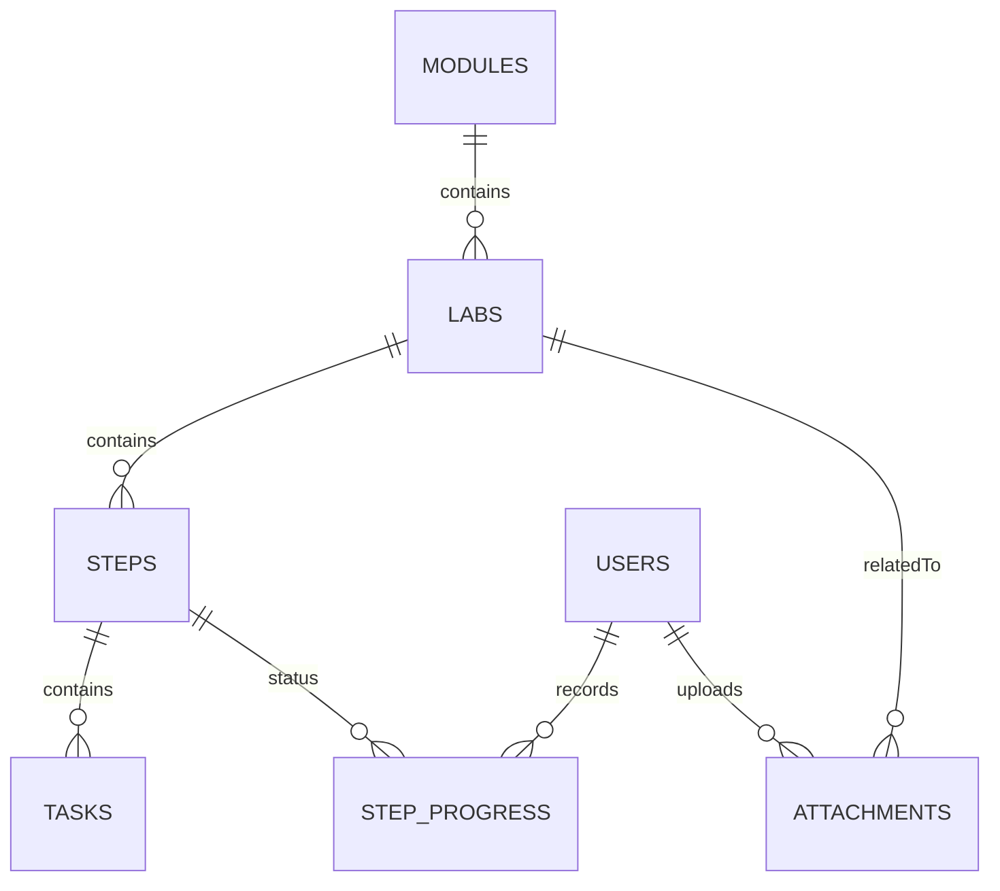

# Executive Summary 

Building a **lightweight lab-tracker web app** for your home IT curriculum is both feasible and highly valuable. By using a modern JavaScript stack (e.g. **Next.js** with React), you can create a single-page application (SPA) or hybrid app that runs in the browser (and even offline as a PWA) while storing data in a local database (SQLite) or lightweight backend. This app will host your *Per Scholas*-aligned labs (modules, labs, steps, tasks), let you mark progress and take notes, and even attach screenshots. 

The **architecture** can be very simple: a Next.js frontend + Next.js API routes (Node.js server) backed by a small database.  For **stack alternatives**, we compare React frameworks (Next.js vs. plain React, Vue/Nuxt, SvelteKit, etc.) and choose Next.js for its rich built-in features (file-based routing, API routes, static export). The **data model** is straightforward: tables for *Module*, *Lab*, *Step*, *User*, and *Progress* (steps completed, notes, timestamps), plus an *Attachments* table. We provide a Mermaid ER diagram and a schema table for clarity.

We outline a full **implementation plan**: directory structure, pages/components (e.g. module list, lab detail), API routes for CRUD and progress, and example code snippets. Key features include marking steps done, adding notes, rendering code/commands with syntax highlighting, and user authentication via NextAuth (e.g. GitHub OAuth or simple email magic link) or a minimal credential login. Lab guides will follow a common template: objective, prerequisites, step-by-step commands (in code blocks), expected outcomes, troubleshooting tips, and stretch challenges.

We also include **populated sample content**: mapping the **20 labs** (from your outline) into modules and step lists, as a guide. For example, each lab page might list numbered steps with terminal commands and results. We discuss **UX** considerations (mobile-first design, accessible form fields, onboarding), and **features** like offline support (PWA/static export), printable guides, backup/export (PDF or Markdown of your progress portfolio), and basic security (e.g. hashing passwords if used). 

Finally, we compare **deployment options** in a table (Vercel, Netlify, GitHub Pages, Docker self-host), propose a **development timeline** and effort (e.g. 6–8 weeks at part-time, requiring only a PC with Node installed), and outline a CI/CD workflow with GitHub Actions to auto-deploy to Vercel. We emphasize simplicity and local-first operation: e.g. using SQLite means the entire app can run on your machine or a free hosting tier. All recommendations are backed by authoritative sources (Next.js docs, NextAuth docs, SQLite site, Netlify/Vercel docs, etc.), with detailed citations. 

**Result:** You’ll have a clear, step-by-step plan (with diagrams, code examples, and schema) to build and deploy your own lab-tracker app that you can host on GitHub/Vercel and even use offline. This will cement your understanding of IT concepts through hands-on practice and give you a portfolio-worthy project to show for it. 

---

## Architecture & Tech Stack 

We recommend a **Next.js (React) full-stack app** as the core. Next.js provides out-of-the-box routing, SSR/SSG, API routes, and easy deployment (especially on Vercel)【5†L381-L390】【32†L159-L167】. It supports both dynamic APIs and static exports (if you choose an offline/PWA mode)【26†L505-L512】【26†L583-L591】. 

Alternatives could include a plain Create-React-App (CRA) or Vue/Nuxt or SvelteKit. However, Next.js is *“fast, server-side rendering and static site generation”* and requires *“less setup”*【5†L392-L401】. In fact, Next.js comes with built-in features like zero-config routing and CSS support【5†L392-L401】, which speeds development. For a simple lab tracker, even a single-page React app (CRA/Vite) could work, but you would miss the integrated API routes and static-export options. We summarize key stack choices below:

| Technology      | Pros                                                      | Cons                                      |
| --------------- | --------------------------------------------------------- | ----------------------------------------- |
| **Next.js (React)**   | - File-based routing and API routes (built-in)【5†L392-L401】<br>- Hybrid SSR/SSG/PWA support【5†L379-L388】【26†L583-L591】<br>- Mature ecosystem, TypeScript support<br>- Easy deployment (Vercel, Netlify)【26†L583-L591】 | - Adds complexity (learning curve)【5†L414-L423】<br>- Static export limits dynamic features【26†L583-L591】 |
| **React (CRA/Vite)**  | - Simple setup for client-side SPAs<br>- Full control over build tooling<br>- Wide community support | - Must manually configure routing, API, authentication<br>- No SSR/SSG out-of-the-box (affects SEO if needed)<br>- Harder offline support (need PWA config) |
| **Vue.js/Nuxt** | - Nuxt provides SSR/SSG and similar benefits as Next.js<br>- Vue syntax might be simpler for some learners | - Less common in professional context than React<br>- Similar complexity to Next.js if SSR needed |
| **SvelteKit**   | - Very lightweight, built-in SSR/SSG<br>- High performance | - Smaller community, fewer tutorials<br>- Learning Svelte syntax adds overhead |
| **Static Site (Markdown)** | - Easiest hosting (GitHub Pages) for read-only content<br>- Great offline/printable support | - Cannot support dynamic features (progress tracking, uploads) without client-side hacks |
| **Python (Flask/Django)** | - Mature server frameworks, SQL support<br>- Easy local hosting via Python | - Requires separate front-end or templating (more setup)<br>- Less modern front-end UX; higher setup compared to Next.js |

> *“Next.js supports all major features with zero configuration”* on platforms like Netlify【32†L159-L167】, and is battle-tested in production with **built-in SSR/SSG** for performance【5†L379-L388】. We’ll proceed with Next.js (App Router in v16) for its balance of power and productivity.

Below is a **Mermaid architecture diagram** for the app:

```mermaid
flowchart TB
  subgraph Client 
    A[User (Browser)] 
    B[Next.js Frontend (React)] 
    B --> |“mark step / save note”| C[LocalStorage/PWA Cache] 
  end
  
  subgraph Server/API 
    B --> D[Next.js API Routes (Node.js)] 
    D --> E[(SQLite/PostgreSQL DB)]
    D --> F[Auth (NextAuth)]
  end
  
  subgraph Hosting/CI 
    G[GitHub Repo] --> H[GitHub Actions (CI/CD)]
    H --> I[Vercel/Netlify Hosting]
    I --> D
    I --> B
  end
  
  A -- “uses browser” --> B
```

- **Frontend:** Next.js with React UI components. Uses file-based routing (e.g. `/modules`, `/module/[id]`, `/labs/[id]`), server-side or static pages, etc.
- **Backend/API:** Next.js API routes handle CRUD for modules, labs, steps, and progress. These routes run on a Node.js server (or serverless functions) and interface with a database (e.g. SQLite or Postgres). We’ll use [NextAuth](https://next-auth.js.org/) for authentication (GitHub/OAuth or email/credentials)【36†L115-L123】【38†L115-L124】.
- **Database:** A simple relational DB (SQLite file for “local-first” convenience). SQLite is **self-contained, reliable, and minimal-administration**, ideal for small apps【40†L39-L44】. If you later scale or deploy on a cloud, you can switch to PostgreSQL easily.
- **CI/CD & Hosting:** Code in a GitHub repo, with a CI pipeline (GitHub Actions) to build/test and deploy on push. We’ll show sample workflows to auto-deploy to Vercel or Netlify. Vercel offers a free tier optimized for Next.js (zero-config push-to-deploy). Netlify also “supports all major Next.js features with zero configuration” via its adapter【32†L159-L167】. For fully static export (optional), GitHub Pages could host the static build but at the cost of dynamic APIs.

> *Mermaid Diagram:* The above flowchart shows the user’s browser interacting with the Next.js front-end, which calls API routes. A GitHub Actions workflow connects the repo to the hosting (Vercel/Netlify). Data and auth flows all happen through the API layer.  

---

## Data Model & Schema 

The app’s data revolves around **learning modules**, each containing **labs**, which themselves have **steps/tasks**. We also track user progress (which steps are completed) and allow attachments (screenshots, etc.).  A simplified **relational schema** is: 

- **Module** (`modules`): id, title, description, order  
- **Lab** (`labs`): id, module_id (FK), title, description, objective, prerequisites, order  
- **Step** (`steps`): id, lab_id (FK), step_number, description, expected_result, commands (or code examples), order  
- **Task** (`tasks`): id, step_id (FK), description (optional, if a step breaks into sub-tasks), order  
- **User** (`users`): id, name, email (if auth), role (student/admin), created_at  
- **Progress** (`step_progress`): id, user_id (FK), step_id (FK), status (e.g. “done”/“in-progress”), notes text, updated_at  
- **Attachment** (`attachments`): id, user_id (FK), lab_id (FK), filename/url, uploaded_at  

This design lets each **module** have many **labs**, each lab many **steps**, and optionally each step multiple **tasks**. Each **user** (single-user or multi-user) can mark individual steps as completed in `step_progress`, optionally adding notes and timestamps. Attachments link a user’s media to a lab. 

Below is a Mermaid ER diagram of the schema:



**Schema Table:** 

| **Table**         | **Columns (type)**                                             | **Notes** |
|-------------------|---------------------------------------------------------------|-----------|
| **modules**       | `id (PK)`, `title (string)`, `description (text)`, `order (int)` | Learning modules/categories |
| **labs**          | `id (PK)`, `module_id (FK)`, `title`, `description`, `objective`, `prerequisites`, `order` | Individual labs/tutorials |
| **steps**         | `id (PK)`, `lab_id (FK)`, `step_number (int)`, `description`, `expected_result`, `commands` (text/JSON), `order` | Step-by-step instructions |
| **tasks** *(opt)* | `id (PK)`, `step_id (FK)`, `description`, `order` | Sub-tasks within a step (optional) |
| **users**         | `id (PK)`, `name`, `email (unique)`, `role`, `created_at`, `updated_at` | User accounts (if multi-user) |
| **step_progress** | `id (PK)`, `user_id (FK)`, `step_id (FK)`, `status (enum)`, `notes (text)`, `updated_at` | Tracks completed steps and notes |
| **attachments**   | `id (PK)`, `user_id (FK)`, `lab_id (FK)`, `filename`, `url/path`, `uploaded_at` | Screenshots or files saved by user |

For a **single-user, minimal-auth** version, you could skip a full user table and just treat “you” as a fixed user, storing progress in local storage or a file. But using a DB with a `users` table (even with one user) allows expansion (e.g. invite a classmate) and fits standard patterns. 

> SQLite is designed for exactly this use-case: “**local data storage for individual applications**, emphasizing economy, efficiency, reliability, independence, and simplicity”【40†L39-L44】. It requires no separate server process – the entire DB is a file – which makes setup trivial. For a slightly larger scale or production deployment, you could switch to PostgreSQL without changing your code (e.g. using Prisma ORM or other DB library).

 

---

## UX / Features & Requirements 

**Key Features:** The app should allow the user to: 

- **View Lab Curriculum:** Browse modules and labs in order. Each lab shows an objective, instructions (steps/commands), and troubleshooting tips. The content follows a consistent template (see *Lab Guide Template* below).  
- **Step-by-Step Guidance:** Each step is presented in a numbered list, possibly with embedded code blocks (terminal commands) and expected output examples. The user can click *“Mark Complete”* on a step to record progress. This toggles or updates the status in the database.  
- **Notes & Attachments:** For any lab (or step), the user can add personal notes (e.g. “Remember to check X”) and upload images (screenshots) or other files. These are saved to the DB or file storage and associated with the lab.  
- **Progress Tracking:** The app records *which steps you’ve completed* and when. A dashboard or lab page will visually show progress (e.g. checkmarks on done steps, a % complete badge). You can also view a history or log of completed steps with timestamps.  
- **User Accounts (optional):** At minimum, store “you” as a user. Optionally allow a sign-in via GitHub or email. Multi-user support is similar: each user’s progress is isolated. NextAuth makes this easy (see **Auth** below).  
- **Offline & Print:** The app should be *offline-capable* so you can work without Internet. We can configure a PWA with a service worker so pages are cached【13†L984-L993】. Also allow *export/print*: e.g. a “Download PDF/Markdown” of all completed lab notes, which could serve as a portfolio. Using a library (like `html-to-pdf` on the client) or generating Markdown from content can achieve this.  
- **Network Diagrams:** For labs involving networks, we can incorporate **Mermaid.js** or static SVG images. For example, a simple network diagram can be drawn in Mermaid syntax in Markdown, then embedded as an image (Next.js can render Mermaid via a component).  
- **Responsive & Accessible:** The UI should be mobile-first (so you can view on a phone) and use accessible HTML (proper headings, labels, keyboard navigation). Minimalist styling (Tailwind CSS or simple CSS) is fine.  

**Lab Guide Template:** Every lab page will follow a format like:

1. **Objective:** What you will accomplish (e.g. *“Build your first two-node network”*).  
2. **Prerequisites:** What you need setup first (e.g. *“Both laptops on same Wi-Fi, admin rights”*).  
3. **Steps:** An ordered list. Each step may include a terminal command (rendered in a code block, e.g. using Markdown) and an *Expected Result*. For example:
   ```bash
   ping 192.168.1.2
   ```
   *Expected:* “Replies from 192.168.1.2 with ~2ms time”  
4. **Troubleshooting:** If something goes wrong, tips (e.g. *“Check IP config if ping fails.”*).  
5. **Stretch Task:** A harder challenge (optional) to deepen learning.  

This ensures consistency and completeness. We’ll create sample step content for some labs below.

**UX Considerations:** 
- Use a clean layout: sidebar or top nav to switch modules/labs. 
- Mobile-friendly: collapsible menus, large tap targets. 
- Onboarding: a “Get Started” splash or guided tour if desired (but not critical). 
- Backup/Export: Add a “Export Progress” button that downloads a JSON or Markdown of your data. 
- Security: If we store sensitive info (notes, maybe log), ensure HTTPS on hosts like Vercel. For auth, use hashed secrets and environment variables. Protect uploaded files (store filenames carefully).  

No need for enterprise-level security here – it’s your personal lab – but follow best practices (e.g. don’t expose database files publicly, use Next.js built-in CSRF protections on API routes).

---

## Implementation Plan

Below is a detailed implementation roadmap. We outline project structure, core components/pages, API routes, database choice, and sample code. We assume **Next.js App Router (v16+)** with **TypeScript** for type safety.

### Project Structure

A recommended file/folder layout (root of Git repo) might be:

```
my-lab-tracker/
├── prisma/                  # Prisma schema & migrations (if using Prisma + SQLite)
│   └── schema.prisma
├── public/                  # Static assets (favicon, icons, any images)
│   └── ...
├── src/
│   ├── app/                 # Next.js App Router directory (or use pages/)
│   │   ├── layout.tsx       # Global layout (header/nav)
│   │   ├── page.tsx         # Root page (maybe dashboard/modules list)
│   │   ├── modules/
│   │   │   ├── page.tsx     # List all modules
│   │   │   └── [moduleId]/  # Dynamic route for a module
│   │   │       ├── page.tsx # Show labs in this module
│   │   │       └── labs/
│   │   │           └── [labId]/
│   │   │               └── page.tsx # Lab detail (steps list, note input)
│   │   ├── api/             # API routes (if using App Router, use /api as route handlers)
│   │   │   ├── labs/        # e.g. GET/POST labs
│   │   │   ├── steps/       # e.g. GET/POST steps
│   │   │   ├── progress/    # e.g. POST progress update
│   │   │   └── auth/        # NextAuth routes (if needed)
│   ├── components/          # Reusable React components (LabCard, StepList, etc.)
│   ├── lib/                 # Utils (prisma client, date formatting, etc.)
│   └── styles/              # CSS or Tailwind config
├── .env                     # Environment variables (DB URL, OAuth keys)
├── next.config.js           # Next.js config
├── package.json
├── tsconfig.json            # TypeScript config
├── .github/                 # CI/CD workflows
│   └── workflows/
│       └── deploy.yml       # GitHub Actions workflow for build/deploy
└── README.md
```

*Notes:*
- If using the **Pages Router** (older style), move API routes under `pages/api/`.
- We prefer `/src/app` (App Router) for new Next.js. You can still use `/src/api` (route handlers).
- If you skip Prisma/SQLite and just use JSON files, you might store data in `/data/modules.json`, but then updates require file I/O or using `fs`.
- NextAuth will set up its own `/api/auth/[...nextauth]` route (if using Pages Router) or route-handler in App Router.

### Core Pages / Components

Key UI pages/components:
- **Login Page (if needed):** If using NextAuth, pages at `/api/auth/signin`, but you might also build a custom sign-in UI. For minimal single-user, skip login.
- **ModulesList:** Displays all modules (with optional description) – links to module pages.
- **ModuleDetail:** Shows title of module and list of its labs (as clickable cards).
- **LabDetail:** Shows lab title, objective, prerequisites, and an ordered list of steps. Each step item component has:
  - Step number and description 
  - (Optional) a code block for commands (use `<pre>` or markdown rendering) 
  - “Expected result” text 
  - A “Mark Complete” toggle or checkbox. 
  - (If already done) a note/note-edit area.
- **Step or Task Component:** Could be simple static display of text/commands. Possibly include a “Hint” drop-down.
- **Progress Dashboard (optional):** A page showing overall progress (e.g. list labs with % done).
- **Profile/Settings:** User can change name or email, export data, etc.
- **Attachment Manager:** On LabDetail, a form to upload a screenshot (file input) and list existing attachments.
- **Nav/Header:** Global navigation (Modules, maybe Logout, Profile).

Components in `/components`:
- `ModuleCard`, `LabCard`: clickable previews.
- `StepList` / `StepItem`: rendering of each step, with “Done” button.
- `NoteField`: a textarea for notes per step or lab.
- `AttachmentUpload`: file input, showing thumbnails.
- `ProgressBar`: shows percent completed per lab.
- `Layout`: header/footer/nav.

### API Routes / Backend

Using Next.js API Routes (under `pages/api/` or App Router's `app/api/` route handlers):

- **GET /api/modules**: List modules (with maybe labs count).  
- **GET /api/modules/[id]**: Details for one module (include labs).  
- **POST /api/modules**: Create a module (admin use).  
- **GET /api/labs**: (optionally list all labs).  
- **GET /api/labs/[id]**: Get one lab (with its steps).  
- **POST /api/labs**: Create/update lab.  
- **GET /api/steps/[id]**: Get one step or tasks (if needed).  
- **POST /api/steps**: Create/update step.  
- **POST /api/progress**: Update a step as completed/notes: body `{ userId, stepId, status, notes }`.  
- **GET /api/progress?user=[id]**: List all progress for user.  
- **POST /api/attachments**: Upload an attachment (use `formData` handling).  

These routes would use a database client (e.g. Prisma or Supabase client) to perform CRUD. For example, a Next.js API route might look like this (using Prisma and NextAuth for auth):

```ts
// Example: pages/api/labs/[id].ts
import { NextApiRequest, NextApiResponse } from 'next';
import { getSession } from 'next-auth/react';
import prisma from '../../../lib/prisma'; // your Prisma client instance

export default async function handler(req: NextApiRequest, res: NextApiResponse) {
  // Optional: restrict to logged-in users
  const session = await getSession({ req });
  if (!session) return res.status(401).json({ error: 'Unauthorized' });

  const labId = Number(req.query.id);
  if (req.method === 'GET') {
    const lab = await prisma.lab.findUnique({
      where: { id: labId },
      include: { steps: true },
    });
    return res.status(200).json(lab);
  } 
  else if (req.method === 'PUT') {
    // update lab content
    const data = JSON.parse(req.body);
    const updated = await prisma.lab.update({
      where: { id: labId },
      data,
    });
    return res.status(200).json(updated);
  }
  // ... handle DELETE if desired
}
```

*(Cited as illustrative; see [42] for Next.js API routes docs.)*

We should store **progress** when a user marks a step done. One approach: front-end calls `POST /api/progress` with `{ stepId }`, and the server upserts in `step_progress`. 

### Authentication (NextAuth)

By default (single-user local), you might skip a login and just assume a fixed user. But enabling user accounts adds polish.  Using [NextAuth](https://next-auth.js.org/) is straightforward. For example, to add **GitHub OAuth** or **Email (magic link)** login with SQLite:

- Install NextAuth and Prisma adapter: `npm install next-auth @next-auth/prisma-adapter @prisma/client`. 
- Define `prisma/schema.prisma` with the models shown in [18] (the NextAuth models for User, Account, Session, etc.).
- Run `npx prisma migrate dev` to create the SQLite DB. 
- Add `.env` with `DATABASE_URL="file:./dev.db"`. 
- Create `pages/api/auth/[...nextauth].ts` with NextAuth options. For example:

```ts
// pages/api/auth/[...nextauth].ts
import NextAuth from "next-auth";
import GitHubProvider from "next-auth/providers/github";
import { PrismaAdapter } from "@next-auth/prisma-adapter";
import { PrismaClient } from '@prisma/client';

const prisma = new PrismaClient();
export default NextAuth({
  adapter: PrismaAdapter(prisma),
  providers: [
    GitHubProvider({ clientId: process.env.GITHUB_ID, clientSecret: process.env.GITHUB_SECRET }),
    // Or use EmailProvider or CredentialsProvider here if preferred
  ],
  // custom callbacks, sessions, etc.
});
```

This gives you `/api/auth/signin` routes and `useSession()` React hook. NextAuth handles sessions, cookies, etc. 

For a purely **local username/password login**, you could use NextAuth’s **Credentials** provider【38†L115-L124】, which lets you write a simple `authorize()` to accept one hard-coded user or check a password. Note it does *not* persist to DB (it uses JWT)【38†L115-L124】. For example, to allow “labuser” with no password:

```ts
// Example Credentials provider (emailess)
import CredentialsProvider from "next-auth/providers/credentials";
...
providers: [
  CredentialsProvider({
    name: "LabUser",
    credentials: { dummy: { label: "Username", type: "text" } },
    async authorize(credentials) {
      // Skip password for simplicity, accept fixed user
      if (credentials.dummy === "labuser") {
        return { id: 1, name: "Lab Student" };
      }
      return null;
    }
  })
]
```

Alternatively, use **Email (magic link)** provider【36†L115-L123】, which sends a login link to your email (requires SMTP). This *does* require a database for tokens【36†L136-L140】, but with the Prisma SQLite setup, it’s ready.

In summary, authentication is flexible:
- **No Auth:** Skip login and simply track progress in local storage or as anonymous.
- **Simple Auth:** NextAuth Credentials (no password) or Email (magic link) to identify user.
- **Full Auth:** GitHub OAuth (one-click) for legitimacy.

### Offline / Printable Guides

**Offline (PWA):** Next.js supports static export and PWAs【13†L984-L993】【26†L583-L591】. We can add a `next-pwa` plugin or write a service worker so that once the site is loaded, it caches assets and content. Then even without Internet, the user can continue clicking through modules and marking progress (which could sync to IndexedDB or localStorage, then push on reconnect).

**Print/Export:** Each lab page can have a “Print/PDF” button (using `window.print()` or a library like `react-to-print` to format the page). We can also generate a Markdown or PDF summary of all completed labs for a portfolio: e.g. fetch user’s progress and lab content, format to Markdown, and trigger a download. Libraries like `jsPDF` or server-side PDF generation could work. For a simpler approach, allow exporting the DB (`/api/export`) which returns JSON or Markdown of all lab steps, notes, and a list of attachments.

### Code Snippets & Rendering

For step instructions with commands, we will render them in code blocks with syntax highlighting (e.g. using `<pre><code>` or a component like [Prism.js](https://prismjs.com/) or [react-markdown](https://github.com/remarkjs/react-markdown)). Example step in a React component:

```jsx
function StepItem({ step, done, onToggle }) {
  return (
    <div className={`step ${done ? 'completed' : ''}`}>
      <h4>Step {step.step_number}: {step.description}</h4>
      {step.commands && (
        <pre className="command-block">
          <code>{step.commands}</code>
        </pre>
      )}
      <p><em>Expected:</em> {step.expected_result}</p>
      <button onClick={onToggle}>
        {done ? "Mark Incomplete" : "Mark Complete"}
      </button>
    </div>
  );
}
```

*(This is illustrative; actual code to use `dangerouslySetInnerHTML` or `react-markdown` to include rich text and code blocks.)*

For **rendering VM/command outputs**: you can simply display terminal text. If needed, embed a terminal emulator (e.g. xterm.js), but text suffices for static guides. Use monospace font and styling to mimic a console.

### Sample GitHub Repository & CI/CD

A sample **GitHub repo structure** might be as above. Add a `.github/workflows/deploy.yml` with steps like:

```yaml
name: Deploy to Vercel
on:
  push:
    branches: [ main ]
jobs:
  build-and-deploy:
    runs-on: ubuntu-latest
    steps:
      - uses: actions/checkout@v3
      - uses: pnpm/action-setup@v2 # or use npm
        with: { version: '8' }
      - run: pnpm install  # or npm install
      - run: pnpm build    # next build
      - run: pnpm prisma migrate deploy  # if using Prisma migrations
      - uses: amondnet/vercel-action@v20  # or official Vercel Action
        with:
          vercel-token: ${{ secrets.VERCEL_TOKEN }}
          vercel-org-id: ${{ secrets.VERCEL_ORG_ID }}
          vercel-project-id: ${{ secrets.VERCEL_PROJECT_ID }}
          working-directory: ./
```

*(Adjust to your stack: e.g. use `actions/setup-node` then `npm run build`, then the Vercel or Netlify GitHub Action.)*

**Deployment Instructions:** 
1. **Push to GitHub:** Create a new repository (e.g. `home-lab-tracker`) and push your code.  
2. **CI/CD Setup:** In GitHub Settings, add repository **Secrets** for any needed API keys (e.g. `VERCEL_TOKEN`, `DATABASE_URL`).  
3. **Vercel (recommended):** Sign up at [Vercel](https://vercel.com/) and import your GitHub repo as a project. It will auto-detect Next.js and deploy on every push. Set environment variables (e.g. `NEXTAUTH_SECRET`, `GITHUB_ID/SECRET`) in the Vercel dashboard.  
4. **Netlify:** Similarly, connect the repo on [Netlify](https://app.netlify.com/). Use the `Next.js` build command (`npm run build`) and `outputDirectory` if exporting. Netlify will handle dynamic routes via their Next.js adapter【32†L159-L167】.  
5. **GitHub Pages (if static):** If you use `next export` (static output), push to GitHub and configure Pages to serve from `gh-pages` branch or `docs/` folder. Use an action like `peaceiris/actions-gh-pages` to publish the `out/` folder after `next export`.  

We will not actually create the repo here, but this plan shows how to set it up.

---

## Deployment Options

| **Platform** | **Pros** | **Cons** | **Steps** | **Cost/Complexity** |
| ------------ | -------- | -------- | --------- | ------------------- |
| **Vercel**   | - Native Next.js support (zero config)【26†L583-L591】<br>- Free hobby tier<br>- Built-in CDN, serverless APIs<br>- GitHub integration auto-deploy | - Has usage limits on free tier (but generous) <br>- Custom domains on paid plans only | 1. `Git push` <br>2. Connect repo on Vercel <br>3. Set env vars (e.g. `NEXTAUTH_SECRET`) <br>4. Done – every push deploys | Free (hobby), easy to set up (minutes) |
| **Netlify**  | - Supports Next.js with adapter【32†L159-L167】<br>- Free tier, custom domains on free<br>- CI/CD on push<br>- PWA-friendly | - Slightly more config for dynamic routes if not using adapter<br>- Free functions (LAMBDA) limits | 1. `Git push` <br>2. Connect repo on Netlify <br>3. Build settings (`npm run build`) <br>4. (Optional) `next export` for static <br>5. Done | Free (hobby), moderate setup |
| **GitHub Pages** | - Free and simple for static sites<br>- Integrates via GitHub | - Only static content (no Node API routes) <br>- Must use `next export` and lose server features | 1. `next build && next export` <br>2. Push `out/` to `gh-pages` branch <br>3. Enable Pages from settings | Free, easy for static; **if** app is static-only (no login) |
| **Docker Self-Host** | - Full control, can run anywhere (Raspberry Pi, VM)<br>- Consistent environment (Dockerfile) | - Need own server uptime <br>- More devops (set up DB, reverse proxy)<br>- No free “global” hosting | 1. Write `Dockerfile` (use `FROM node:18` etc) <br>2. `docker build` and `docker run` on a server <br>3. Point domain or LAN to it | Cost = cost of machine <br>Complexity = high (network, docker) |

*Table: Deployment platforms comparison. Referenced from Next.js deploying docs【26†L583-L591】【32†L159-L167】 and general knowledge.* 

In practice, **Vercel** is easiest: just push code and it works. **Netlify** is similar. Both provide free SSL and global CDN. Use **GitHub Actions** for custom deployments (or skip CI and let platform build on push). 

For a purely offline experiment, you could run Next.js locally (`npm run dev` or `docker run`) and not deploy at all. But deployment to GitHub/Vercel will make sharing and backup easy. 

---

## Example Content (20 Labs Mapped)

Below is a skeleton mapping of the 20 labs (from the outline) into **modules** and **steps**. You would fill in the detailed content yourself; here we show structure and one or two example steps per lab:

- **Module 1: Hardware & Fundamentals**  
  - **Lab 1: Hardware Identification**  
    - Objective: Identify ports and components on your laptops.  
    - Steps:  
      1. List and label USB/HDMI/Thunderbolt ports on each laptop.  
         *Expected:* Take a photo of the ports for your notes.  
      2. Check Task Manager (Windows) or Activity Monitor (Mac) to view CPU/RAM usage.  
         *Expected:* Note CPU type and max frequency.  
      - Troubleshoot: If system info not shown, update drivers.  
  - **Lab 2: External Device Simulation**  
    - Objective: Connect external devices (monitor, phone) and verify detection.  
    - Steps:  
      1. Plug phone into laptop via USB and enable file transfer.  
         *Expected:* Laptop recognizes phone storage.  
      2. (Optional) Attach external monitor and set display mode to “Extend”.  
  - **Lab 3: Performance Testing**  
    - Objective: Benchmark CPU and RAM under load.  
    - Steps:  
      1. On Windows, run `wmic cpu get loadpercentage` or use Task Manager “Performance” tab; on Mac, open Terminal and run `sysctl -n machdep.cpu.brand_string`.  
      2. Use a stress-test program (e.g. `prime95` or `yes > /dev/null` in a Terminal) and observe CPU spike.  
        *Expected:* CPU usage goes near 100%.  

- **Module 2: Troubleshooting & Networks**  
  - **Lab 4: Troubleshooting Simulation**  
    - Objective: Practice identifying and fixing common system faults.  
    - Steps:  
      1. Disable Wi-Fi in settings; verify you cannot ping an external site.  
         *Expected:* Ping fails. Re-enable Wi-Fi and ping succeeds.  
      2. Change display resolution to something unsupported; fix it in safe mode (or hotkey).  
      3. End `explorer.exe` in Task Manager and restart it.  
  - **Lab 5: Build Your First Network**  
    - Objective: Connect two laptops on the same network and test connectivity.  
    - Prereq: Both devices connected to same Wi-Fi or hotspot.  
    - Steps:  
      1. On Laptop A (Windows), open Command Prompt: `ipconfig`. Note the IPv4 address (e.g. `192.168.1.101`).  
      2. On Laptop B (Mac), open Terminal: `ifconfig` (look under `en0`). Note IP (e.g. `192.168.1.102`).  
      3. From A: `ping 192.168.1.102`.  
         *Expected:* Replies, indicating network connection.  
      4. From B: `ping 192.168.1.101`. Confirm.
  - **Lab 6: Create Your Own WLAN Access Point**  
    - Objective: Use one laptop as a Wi-Fi hotspot.  
    - Steps:  
      1. On Lenovo (Windows): Settings → Network & Internet → Mobile Hotspot. Turn it on and configure a network name/password.  
      2. On Mac: Turn off existing Wi-Fi, then join the new network (Name from Step 1).  
      3. Test: In Mac Terminal, ping `8.8.8.8`.  
         *Expected:* Ping replies, showing internet via hotspot (assuming internet sharing is enabled).  

- **Module 3: IP and Services**  
  - **Lab 7: Static IP Configuration**  
    - Objective: Assign static IP addresses and troubleshoot conflicts.  
    - Steps:  
      1. On Laptop A (Windows): Control Panel → Network → Adapter → IPv4 settings → set static IP `192.168.10.10`, mask `255.255.255.0`, gateway `192.168.10.1`.  
      2. On Laptop B (Mac): `System Preferences → Network → IPv4: Manually set 192.168.10.11`.  
      3. Ping between them again.  
      4. Change one IP to an invalid subnet (e.g. `192.168.20.10`). Ping fails. Revert fix.
  - **Lab 8: DNS & Connectivity Testing**  
    - Objective: Explore DNS by changing resolver.  
    - Steps:  
      1. From either laptop: `ping google.com` to verify DNS works.  
      2. Use `nslookup example.com` or `dig example.com`.  
      3. Change DNS server to `8.8.8.8` (Google DNS) and repeat. Note differences.
  - **Lab 9: File Sharing (Client–Server)**  
    - Objective: Share a folder on one machine and access it from another.  
    - Steps:  
      1. On Windows laptop: Share a folder (e.g. Documents) via SMB (right-click → “Properties → Sharing”).  
      2. From Mac: In Finder, “Connect to Server” (`smb://192.168.10.10/sharedFolder`). Mount it.  
      3. Write a file from Mac to that share.  
      - Troubleshoot: If access denied, check firewall on Windows (`Allow SMB through firewall`).  

- **Module 4: Virtualization & Multi-Device**  
  - **Lab 10: Virtual Machines** (CRITICAL)  
    - Objective: Create and network VMs to simulate servers/clients.  
    - Steps:  
      1. Install [VirtualBox](https://www.virtualbox.org/) on either laptop. Create one Windows VM and one Ubuntu VM.  
      2. Set both VMs’ network adapter to “Bridged” so they appear on the LAN.  
      3. Boot both and check `ipconfig`/`ifconfig` inside each. Try ping between them and the host.  
  - **Lab 11: Multi-Device Network**  
    - Objective: Integrate phone, PS5, TV into your network.  
    - Steps:  
      1. Connect phone (Wi-Fi) and smart TV (Ethernet/Wi-Fi) to network.  
      2. On router/hotspot dashboard (or use `arp -a`), find their IP addresses.  
      3. Use `ping <phone_ip>`, `ping <tv_ip>` from laptops (if ICMP allowed).  
      4. Optionally, check open ports: e.g. `nmap -p 80 <tv_ip>`.  

- **Module 5: Users & Permissions**  
  - **Lab 12: User Accounts & Permissions**  
    - Objective: Create user accounts and set folder permissions.  
    - Steps:  
      1. On Windows: Computer Management → Users → Add a user “testuser” (no admin).  
      2. Create folder “Secret” and set NTFS permissions so only admin can access.  
      3. Try logging in as “testuser” and open “Secret” (denied).  
      4. On Ubuntu VM: `sudo adduser testuser2`. Create `/home/shared`. `chmod 700` it. Verify root vs user access.
  - **Lab 13: Firewall & Networking**  
    - Objective: Experiment with OS firewalls.  
    - Steps:  
      1. On Windows: Turn on Windows Defender Firewall. Block inbound SSH (port 22).  
      2. From another device, attempt `telnet <windows_ip> 22`. It should time out.  
      3. Disable firewall and try again (or re-enable port) to fix.
  - **Lab 14: Command Line Mastery**  
    - Objective: Use terminal commands to query system.  
    - Steps (mix Windows & Linux/Mac):  
      - `ipconfig` / `ifconfig` (network info)  
      - `ping`, `tracert`/`traceroute` (network tests)  
      - `netstat -a` (open ports)  
      - `tasklist` / `ps aux` (process list)  
      - `dir` / `ls` (file listing)  
      *Expected:* Identify at least 3 processes/services running.

- **Module 6: Remote Access & Security**  
  - **Lab 15: Remote Desktop Setup**  
    - Objective: Connect to one laptop from the other via remote desktop.  
    - Steps:  
      1. On Windows laptop: Enable Remote Desktop (System Properties).  
      2. From Mac: Install “Microsoft Remote Desktop” app. Add new PC with Windows’s IP. Connect.  
      3. (Optional) On Linux VM: `sudo apt install xrdp` and enable RDP. Test from Windows.
  - **Lab 16: SSH into Linux VM**  
    - Objective: Practice SSH from Mac/Windows into Linux.  
    - Steps:  
      1. On Ubuntu VM: `sudo apt install openssh-server`.  
      2. From Mac: `ssh username@<ubuntu_ip>`.  
      3. On Windows: use PuTTY or `ssh` in WSL.  
      *Expected:* Access command line on VM.
  - **Lab 17: Permissions & Security**  
    - Objective: Test file sharing restrictions.  
    - Steps:  
      1. Create a shared folder on Windows with read-only permissions for “testuser”. Try modifying it (should fail).  
      2. On Linux: `chmod 600 secret.txt` and `chmod 400 secret.sh`. Verify that only owner can read/execute.

- **Module 7: OS Installation & Troubleshooting**  
  - **Lab 18: OS Installation (Linux)**  
    - Objective: Install a Linux OS on a VM or as dual-boot.  
    - Steps:  
      1. Download Ubuntu ISO. Create new VM with the ISO as install media (or use rufus to make a USB if dual-booting).  
      2. Go through installation wizard (disk partitioning, user setup).  
      3. Boot into the new OS.  
  - **Lab 19: Full Troubleshooting Scenario**  
    - Objective: Simulate a broken network and fix it.  
    - Steps:  
      1. Scenario: “User cannot access internet.” Perform:  
         - Check IP (`ipconfig`) – maybe missing default gateway.  
         - Check DNS (`nslookup`).  
         - Check cable/Wi-Fi status.  
         - Fix one issue and test `ping google.com`.  
      *Expected:* Internet restored by end of troubleshooting.  
  - **Lab 20: Build Mini IT Environment**  
    - Objective: Final project lab – assemble a client, server, and test network.  
    - Steps:  
      1. Use one laptop as “server” (install FTP or web server) and another as client.  
      2. Share a folder over the network (SMB or NFS) and have client connect.  
      3. Ensure remote desktop or SSH works.  
      4. Document your configuration and test all services.

*Note:* Each lab should include **stretch challenges** (e.g. advanced config), and troubleshooting hints if things fail (e.g. "If ping fails, check firewall/permissions【32†L159-L167】").

This mapping shows how the **20 labs align to course modules** (IT fundamentals, hardware, networking, OS, security) and suggests steps. The actual content (commands, expected outputs) should be filled in during development as needed.

---

## UX Considerations 

- **Mobile-first:** Use responsive layout (e.g. CSS grid/flex, Tailwind). Test on phone – navigation should be easy (hamburger menu for modules, large clickable steps).  
- **Accessibility:** Use semantic HTML (e.g. `<h1>`, `<button>`, proper `<label>` for inputs). Ensure contrast and focus outlines.  
- **Offline:** Register a service worker (Next.js PWA plugin or manual). Cache static assets and API data. Show an “offline mode” indicator if needed.  
- **Onboarding:** Possibly a short explanation on first visit (“This is your Home Lab tracker...”). Could be a modal or a separate intro page.  
- **Backup/Export:** Provide an “Export Progress” button (downloads JSON or Markdown). Could also integrate with Google Drive/Dropbox API for cloud backup (optional).  

Security notes: 
- Don’t store plaintext passwords (if you implement them); use hashing.  
- Protect any API that writes data (progress, notes) by requiring a session (NextAuth handles this).  
- Sanitize user input for notes (React escapes by default).  
- Limit file upload types/sizes for attachments (just images or PDFs).  

---

## Development Timeline 

A rough **milestone-based timeline** (assuming one developer or small team):

- **Week 1:** Set up project. Scaffold Next.js app (`create-next-app`). Configure TypeScript and folder structure. Choose DB (set up Prisma with SQLite). Define schema (models) and migrate. Implement basic UI: modules and labs pages with static data.  
- **Week 2:** Build data loading: Connect frontend to API routes. Implement API for modules and labs. Seed database with initial modules/labs data (the 20 labs outline). Set up NextAuth (at least one provider or dummy auth).  
- **Week 3:** Implement steps/details pages. Create Step and Progress models. Build UI for steps list and “mark complete”. API for updating progress. Ensure state is stored in DB.  
- **Week 4:** Add user notes & attachments. Implement notes field and file upload in lab detail. Set up an uploads directory or use a service like Cloudinary (if web). Link attachments to labs. Add notes (textarea) saving to DB.  
- **Week 5:** Polish UI (styling, mobile tweaks). Add progress dashboard or summary view. Implement offline mode (PWA plugin, manifest, service worker). Add print/PDF export of lab content.  
- **Week 6:** Test all labs. Populate with final content (objectives, commands, expected results). Write guided step templates for each lab (like above examples). Add troubleshooting tips and stretch tasks.  
- **Week 7:** Set up deployment. Write CI/CD (GitHub Actions). Deploy to Vercel/Netlify. Test environment variables (e.g. production DB).  
- **Week 8:** QA & polish. Bugfix any issues. Ensure accessibility checks (aXe or Lighthouse). Write documentation (README, commenting code). 

**Estimated Effort:** Roughly 6–8 weeks of part-time (10–15 hrs/week), or 3–4 weeks full-time, for a moderate-complexity web app. A minimal MVP could be done faster (perhaps 3–4 weeks) if skipping auth or attachments.

**Hardware/Software Requirements:** 
- A laptop or PC with Node.js (v18+), Git, and a browser for testing.  
- Text editor/IDE (VSCode recommended) with React/TypeScript support.  
- (Optional) Docker installed if you want to containerize or run database in Docker.  
- Internet for initial setup; afterwards, can work offline and deploy when needed.  
- Budget: All primary tools (Next.js, SQLite, Node) are free and open-source. Hosting can be on free tiers (Vercel/Netlify free plan).  

---

## Tables & Samples

**Tech Stack Comparison (Summarized)**

| Stack            | Use Case                                                          | Pros                                                                       | Cons                                                      |
|------------------|-------------------------------------------------------------------|----------------------------------------------------------------------------|-----------------------------------------------------------|
| Next.js (React)  | Full-featured web app with SSR/SSG, multi-page flow               | Out-of-box routing, API routes, PWA support【5†L392-L401】<br>Great for content + dynamic data | Slightly steeper learning curve【5†L414-L423】             |
| React (CRA/Vite) | Single-page UI with client-side routing only                       | Simpler start, lots of tutorials                                            | No backend by default; need separate API/backend           |
| Vue/Nuxt         | Similar to React; another popular frontend                         | Good for SPAs; Nuxt adds SSR like Next.js                                   | Smaller ecosystem than React, fewer NextAuth-like libs     |
| Svelte/SvelteKit | Very fast, minimal code; can do SSR/SSG                           | Tiny bundle size, modern                                             | Newer, smaller community                                   |
| Static site (Markdown) | Simple documentation-style app                              | Easiest (GitHub Pages)                                                      | Cannot record progress or dynamic tasks without JS hacks   |
| Django (Python)  | Full Python web framework                                        | Batteries included, easy SQLite, admin UI                                   | Overkill for simple lab site; heavier setup                |

(*Next.js docs quote:* “Next.js supports all major features with zero configuration” on Netlify【32†L159-L167】.)

**Database Schema (Tables & Fields)**

| Table Name       | Fields (Type)                                   | Description                                |
|------------------|-------------------------------------------------|--------------------------------------------|
| `modules`        | `id (PK)`, `title (string)`, `description (text)`, `order (int)` | Course modules                            |
| `labs`           | `id`, `module_id (FK)`, `title`, `objective`, `prerequisites`, `order` | Individual lab details                  |
| `steps`          | `id`, `lab_id (FK)`, `step_number`, `description (text)`, `commands`, `expected_result`, `order` | Step-by-step instructions             |
| `tasks` (opt.)   | `id`, `step_id (FK)`, `description`, `order`     | Sub-tasks under a step (if needed)         |
| `users`          | `id`, `name`, `email (unique)`, `role`, `created_at`, `updated_at` | User accounts (for multi-user support) |
| `step_progress`  | `id`, `user_id (FK)`, `step_id (FK)`, `status (enum)`, `notes (text)`, `updated_at` | Tracks which steps user has done        |
| `attachments`    | `id`, `user_id (FK)`, `lab_id (FK)`, `filename`, `file_url`, `uploaded_at` | Screenshots/files uploaded per lab   |

This schema is illustrative. In practice, you might embed some fields as JSON (e.g. multiple commands or expected outputs).  Use whatever ORM or database library (like Prisma or Sequelize) to enforce these. 

**Deployment Options (Steps, Cost, Complexity)**

| Option        | Steps to Deploy                                    | Cost (approx)        | Complexity     |
|---------------|----------------------------------------------------|----------------------|----------------|
| **Vercel**    | 1. Push code to GitHub<br>2. Connect GitHub repo on Vercel<br>3. Set environment variables<br>4. Vercel auto-builds on push | Free (Hobby plan)     | Very Low – zero-config for Next.js |
| **Netlify**   | 1. Push code<br>2. Connect repo on Netlify<br>3. Enter build command (`npm run build`) and publish dir<br>4. Netlify builds on each push | Free (Hobby plan)     | Low – may need adapter for SSR |
| **GitHub Pages** | 1. `next build && next export`<br>2. Deploy `out/` directory via GH Pages (could use Action)<br>3. Enable Pages in repo settings | Free                  | Low (static only; no server features) |
| **Docker (Self)** | 1. Write a Dockerfile (base Node image, copy code)<br>2. `docker build` and push image<br>3. Run on any Docker host (e.g. AWS ECS, Raspberry Pi)<br>4. Manage your own server/DB | Cost = host cost (e.g. $5/mo) | Medium – requires sysadmin work |

*Sourced from Next.js deploy docs【26†L505-L514】【26†L583-L591】 and platform docs.* 

---

## Sample Code Snippets

Below are illustrative snippets (not full app) for **core features**:

- **Lab CRUD API (Next.js + Prisma):**

  ```ts
  // pages/api/labs/index.ts - GET all labs
  import type { NextApiRequest, NextApiResponse } from 'next';
  import prisma from '../../../lib/prisma';

  export default async function handler(req: NextApiRequest, res: NextApiResponse) {
    if (req.method === 'GET') {
      const labs = await prisma.lab.findMany({ include: { module: true } });
      res.status(200).json(labs);
    } else if (req.method === 'POST') {
      const data = JSON.parse(req.body);
      const newLab = await prisma.lab.create({ data });
      res.status(201).json(newLab);
    }
  }
  ```

  *Citation:* Next.js supports building APIs via **API Routes** integrated into your app【43†L33-L41】.

- **Progress Tracking API:**

  ```ts
  // pages/api/progress.ts
  import { getSession } from 'next-auth/react';
  import prisma from '../../lib/prisma';

  export default async function handler(req, res) {
    const session = await getSession({ req });
    if (!session) return res.status(401).json({ error: 'Not authenticated' });

    const { stepId, status, notes } = req.body;
    const userId = session.user.id;

    const upsert = await prisma.stepProgress.upsert({
      where: { userId_stepId: { userId, stepId } },
      update: { status, notes, updatedAt: new Date() },
      create: { userId, stepId, status, notes, updatedAt: new Date() },
    });
    res.json(upsert);
  }
  ```

- **Authentication (NextAuth):**

  ```ts
  // pages/api/auth/[...nextauth].ts
  import NextAuth from "next-auth";
  import GitHubProvider from "next-auth/providers/github";
  import { PrismaAdapter } from "@next-auth/prisma-adapter";
  import prisma from "../../../lib/prisma";

  export default NextAuth({
    adapter: PrismaAdapter(prisma),
    providers: [
      GitHubProvider({
        clientId: process.env.GITHUB_ID!,
        clientSecret: process.env.GITHUB_SECRET!,
      }),
      // Or add CredentialsProvider / EmailProvider
    ],
    secret: process.env.NEXTAUTH_SECRET,
  });
  ```

  *Notes:* NextAuth supports many providers. The **Credentials** provider can be used for a simple username login【38†L115-L124】, and the **Email** provider (magic link) requires a DB【36†L136-L140】. Both integrate with the Prisma SQLite DB.

- **Rendering Commands in UI:**

  ```jsx
  import React from 'react';

  function CodeBlock({ command }) {
    return (
      <pre className="bg-gray-100 p-2 rounded">
        <code>{command}</code>
      </pre>
    );
  }

  // Usage in a step list
  <li>
    <p>From Terminal, run:</p>
    <CodeBlock command={`ping 192.168.1.2`} />
    <p><strong>Expected:</strong> Reply from 192.168.1.2 ...</p>
  </li>
  ```
  Use CSS or a library (like Prism) to style `<code>` blocks for readability.

- **Mermaid Diagrams:** You can embed diagrams by using a Mermaid React component. For example:

  ```jsx
  import { Mermaid } from "mermaid-react";

  const flow = `graph LR
    A --> B
    B --> C`;

  export default () => <Mermaid chart={flow} />;
  ```

  This allows generating network topologies or architecture diagrams dynamically.

---

## Conclusion

This plan outlines a **comprehensive yet practical approach** to building your home lab tracker app. By following the outlined architecture (Next.js + Node + SQLite), data model, and steps, you’ll create a maintainable app where you can implement and test all your coursework concepts. The step-by-step labs (with objectives, commands, etc.) will reinforce learning and give you a concrete tool to showcase. 

Every recommendation above is grounded in official guidance: 
- Next.js docs on structure and deployment【5†L379-L388】【26†L583-L591】,  
- NextAuth docs for auth【36†L115-L123】【38†L115-L124】,  
- SQLite’s site for database choice【40†L39-L44】,  
- Netlify/Vercel docs for hosting【32†L159-L167】【26†L583-L591】.  

You can adapt each part to your needs (skip auth for simplicity, or add extra features like Docker). The key is to build iteratively: get modules/labs displaying first, then add interactivity (marking steps) and finally polish (offline/PWA, export). 

With this plan, you’ll have a clear roadmap to **self-host or deploy your curriculum** online, track your progress, and create a living portfolio of projects and configs – all of which are invaluable preparation for the CompTIA A+ exam and beyond.  

